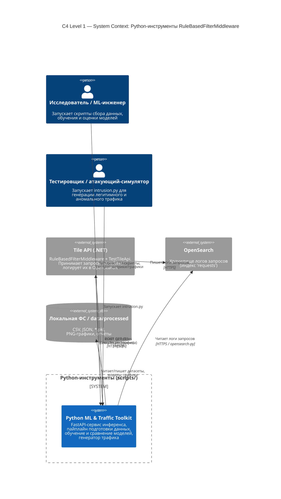

# C4 Level 1 — System Context

Показывает Python-подсистему как один «чёрный ящик» и её внешних
акторов/системы.

```mermaid
C4Context
    title C4 Level 1 — System Context: Python-инструменты RuleBasedFilterMiddleware

    Person(researcher, "Исследователь / ML-инженер", "Запускает скрипты сбора данных,<br/>обучения и оценки моделей")
    Person(tester, "Тестировщик / атакующий-симулятор", "Запускает intrusion.py для<br/>генерации легитимного и<br/>аномального трафика")

    System_Boundary(py, "Python-инструменты (scripts/)") {
        System(pytools, "Python ML & Traffic Toolkit", "FastAPI-сервис инференса,<br/>пайплайн подготовки данных,<br/>обучение и сравнение моделей,<br/>генератор трафика")
    }

    System_Ext(tileApi, "Tile API (.NET)", "RuleBasedFilterMiddleware + TestTileApi.<br/>Принимает запросы на тайлы,<br/>логирует их в OpenSearch.")
    System_Ext(opensearch, "OpenSearch", "Хранилище логов запросов<br/>(индекс 'requests')")
    SystemDb_Ext(fs, "Локальная ФС / data/processed", "CSV, JSON, *.pkl,<br/>PNG-графики, отчёты")

    Rel(researcher, pytools, "Запускает CLI-скрипты,<br/>смотрит метрики/графики")
    Rel(tester, pytools, "Запускает intrusion.py")

    Rel(pytools, opensearch, "Читает логи запросов", "HTTPS / opensearch-py")
    Rel(pytools, tileApi, "Шлёт GET /Tiles<br/>(симуляция трафика)", "HTTP")
    Rel(tileApi, opensearch, "Пишет логи запросов", "HTTPS")
    Rel(pytools, fs, "Читает/пишет датасеты,<br/>модель, графики", "FS I/O")
    Rel(tileApi, pytools, "POST /predict<br/>(онлайн-инференс)", "HTTP/JSON")
```
