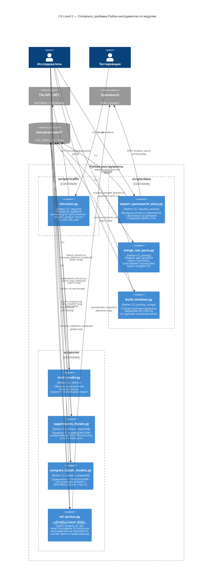

# C4 Level 2 — Container

Каждый `.py`-модуль = отдельный «контейнер» (исполняемый процесс/скрипт).
Сгруппированы по подпапкам `scripts/`.

```mermaid
C4Container
    title C4 Level 2 — Containers: разбивка Python-инструментов по модулям

    Person(researcher, "Исследователь")
    Person(tester, "Тестировщик")
    System_Ext(tileApi, "Tile API (.NET)", "TestTileApi + Middleware")
    System_Ext(opensearch, "OpenSearch", "index 'requests'")
    SystemDb_Ext(fs, "data/processed/*", "CSV / JSON / PKL / PNG")

    System_Boundary(py, "Python-инструменты") {

        Container_Boundary(traffic, "scripts/traffic") {
            Container(intrusion, "intrusion.py", "Python CLI, requests", "Генератор трафика:<br/>режимы grid / grid_reverse /<br/>random_unique / burst /<br/>human_like_pan")
        }

        Container_Boundary(data, "scripts/data") {
            Container(export, "export_opensearch_since.py", "Python CLI, requests, pandas", "Выгрузка хитов из OpenSearch<br/>с фильтром по времени.<br/>Сохраняет JSON и CSV.")
            Container(merge, "merge_raw_jsons.py", "Python CLI, pandas", "Сливает два raw-JSON<br/>(clean / synthetic),<br/>проставляет sourceLabel,<br/>пишет merged CSV.")
            Container(windows, "build_windows.py", "Python CLI, pandas, numpy", "Считает оконные признаки<br/>(WINDOW=30, STEP=5)<br/>по группам userIp+sessionId.")
        }

        Container_Boundary(ml, "scripts/ml") {
            Container(train, "train_model.py", "Python CLI, sklearn", "Обучает IsolationForest<br/>на clean-окнах,<br/>скоринг + classification report.")
            Container(exp, "experiments_iforest.py", "Python CLI, sklearn, matplotlib", "Перебор IF по WINDOW/STEP/<br/>contamination, ROC/PR/score-hist,<br/>отчёт + meta.json.")
            Container(compare, "compare_classic_models.py", "Python CLI, sklearn, matplotlib", "Сравнение IF / OneClassSVM /<br/>LOF (novelty): метрики +<br/>ROC/PR/score-hist + bar F1.")
            Container(svc, "ml_service.py", "FastAPI / Uvicorn :8000", "REST-сервис POST /predict.<br/>Грузит модель из .pkl,<br/>тянет последние 50 запросов<br/>пользователя из OpenSearch,<br/>считает фичи и предсказание.")
        }
    }

    Rel(researcher, export, "CLI: --gte / --local")
    Rel(researcher, merge, "CLI")
    Rel(researcher, windows, "CLI")
    Rel(researcher, train, "CLI")
    Rel(researcher, exp, "CLI")
    Rel(researcher, compare, "CLI")
    Rel(researcher, svc, "uvicorn ml_service:app")
    Rel(tester, intrusion, "CLI: --mode --url ...")

    Rel(intrusion, tileApi, "GET /Tiles?z&x&y&sessionId", "HTTP")
    Rel(export, opensearch, "POST /{index}/_search", "HTTPS+JSON")
    Rel(svc, opensearch, "search(index='requests')", "opensearch-py")
    Rel(tileApi, svc, "POST /predict", "HTTP/JSON")

    Rel(export, fs, "requests_since.json/.csv", "write")
    Rel(merge, fs, "requests_merged_labeled.csv", "read raw / write csv")
    Rel(windows, fs, "windows_features.csv", "read / write")
    Rel(train, fs, "iforest_scored.csv,<br/>intrusion_detection_model.pkl", "read / write")
    Rel(exp, fs, "experiments_iforest.csv,<br/>plots/*.png, meta.json", "read / write")
    Rel(compare, fs, "model_compare.csv,<br/>plots_models/*.png", "read / write")
    Rel(svc, fs, "intrusion_detection_model.pkl", "joblib.load")
```
