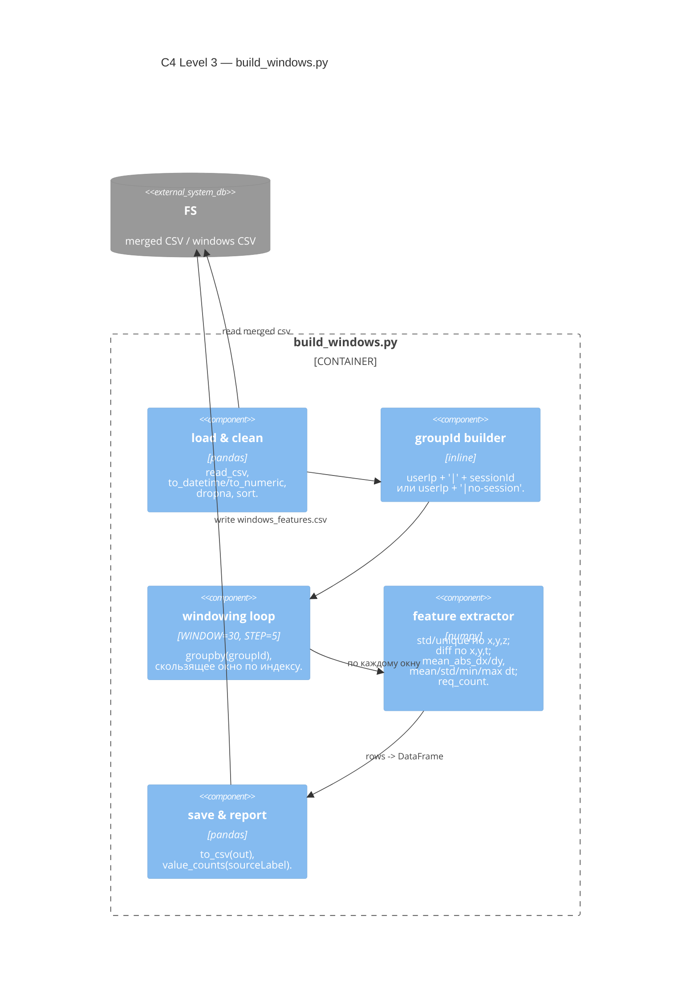

# C4 Level 3 — Component: `scripts/data/build_windows.py`

```mermaid
C4Component
    title C4 Level 3 — build_windows.py
    SystemDb_Ext(fs, "FS", "merged CSV / windows CSV")

    Container_Boundary(c, "build_windows.py") {
        Component(load, "load & clean", "pandas", "read_csv,<br/>to_datetime/to_numeric,<br/>dropna, sort.")
        Component(group, "groupId builder", "inline", "userIp + '|' + sessionId<br/>или userIp + '|no-session'.")
        Component(wloop, "windowing loop", "WINDOW=30, STEP=5", "groupby(groupId),<br/>скользящее окно по индексу.")
        Component(feat, "feature extractor", "numpy", "std/unique по x,y,z;<br/>diff по x,y,t;<br/>mean_abs_dx/dy,<br/>mean/std/min/max dt;<br/>req_count.")
        Component(save, "save & report", "pandas", "to_csv(out),<br/>value_counts(sourceLabel).")
    }

    Rel(load, group, "")
    Rel(group, wloop, "")
    Rel(wloop, feat, "по каждому окну")
    Rel(feat, save, "rows -> DataFrame")
    Rel(load, fs, "read merged csv")
    Rel(save, fs, "write windows_features.csv")
```
