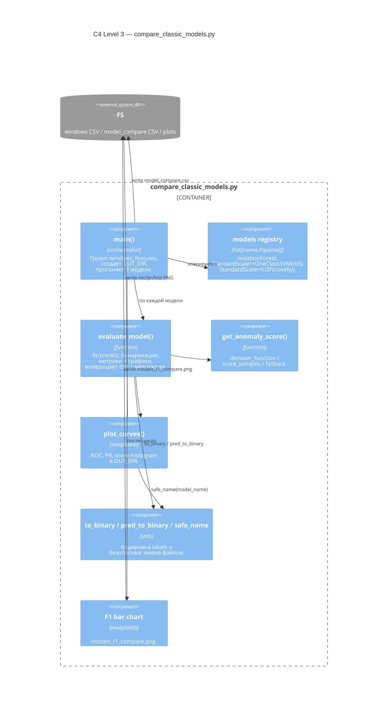

# C4 Level 3 — Component: `scripts/ml/compare_classic_models.py`

```mermaid
C4Component
    title C4 Level 3 — compare_classic_models.py
    SystemDb_Ext(fs, "FS", "windows CSV / model_compare CSV / plots")

    Container_Boundary(c, "compare_classic_models.py") {
        Component(main, "main()", "orchestrator", "Грузит windows_features,<br/>создаёт OUT_DIR,<br/>прогоняет 3 модели.")
        Component(models, "models registry", "list[(name,Pipeline)]", "IsolationForest,<br/>StandardScaler+OneClassSVM(rbf),<br/>StandardScaler+LOF(novelty).")
        Component(eval_, "evaluate_model()", "function", "fit/predict, бинаризация,<br/>метрики + графики,<br/>возвращает dict с метриками.")
        Component(score, "get_anomaly_score()", "function", "decision_function /<br/>score_samples / fallback.")
        Component(plot, "plot_curves()", "matplotlib", "ROC, PR, score-histogram<br/>в OUT_DIR.")
        Component(util, "to_binary / pred_to_binary / safe_name", "utils", "Кодировка labels и<br/>безопасные имена файлов.")
        Component(bar, "F1 bar chart", "matplotlib", "models_f1_compare.png.")
    }

    Rel(main, models, "итерируется")
    Rel(main, eval_, "по каждой модели")
    Rel(eval_, score, "")
    Rel(eval_, plot, "")
    Rel(eval_, util, "to_binary / pred_to_binary")
    Rel(plot, util, "safe_name(model_name)")
    Rel(main, bar, "после цикла")
    Rel(main, fs, "read windows_features.csv")
    Rel(main, fs, "write model_compare.csv")
    Rel(plot, fs, "write roc/pr/hist PNG")
    Rel(bar, fs, "write models_f1_compare.png")
```
