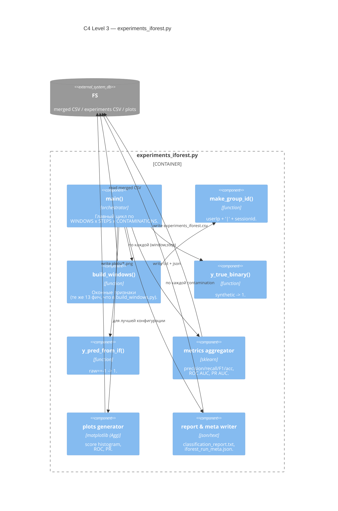

# C4 Level 3 — Component: `scripts/ml/experiments_iforest.py`

```mermaid
C4Component
    title C4 Level 3 — experiments_iforest.py
    SystemDb_Ext(fs, "FS", "merged CSV / experiments CSV / plots")

    Container_Boundary(c, "experiments_iforest.py") {
        Component(main, "main()", "orchestrator", "Главный цикл по<br/>WINDOWS x STEPS x CONTAMINATIONS.")
        Component(grpid, "make_group_id()", "function", "userIp + '|' + sessionId.")
        Component(bw, "build_windows()", "function", "Оконные признаки<br/>(те же 13 фич, что в build_windows.py).")
        Component(ybin, "y_true_binary()", "function", "synthetic -> 1.")
        Component(ypred, "y_pred_from_if()", "function", "raw==-1 -> 1.")
        Component(metrics, "metrics aggregator", "sklearn", "precision/recall/F1/acc,<br/>ROC AUC, PR AUC.")
        Component(plots, "plots generator", "matplotlib (Agg)", "score histogram,<br/>ROC, PR.")
        Component(meta, "report & meta writer", "json/text", "classification_report.txt,<br/>iforest_run_meta.json.")
    }

    Rel(main, bw, "по каждой (window,step)")
    Rel(bw, grpid, "")
    Rel(main, ybin, "")
    Rel(main, ypred, "")
    Rel(main, metrics, "по каждой contamination")
    Rel(main, plots, "для лучшей конфигурации")
    Rel(main, meta, "")
    Rel(bw, fs, "read merged CSV")
    Rel(metrics, fs, "write experiments_iforest.csv")
    Rel(plots, fs, "write plots/*.png")
    Rel(meta, fs, "write txt + json")
```
