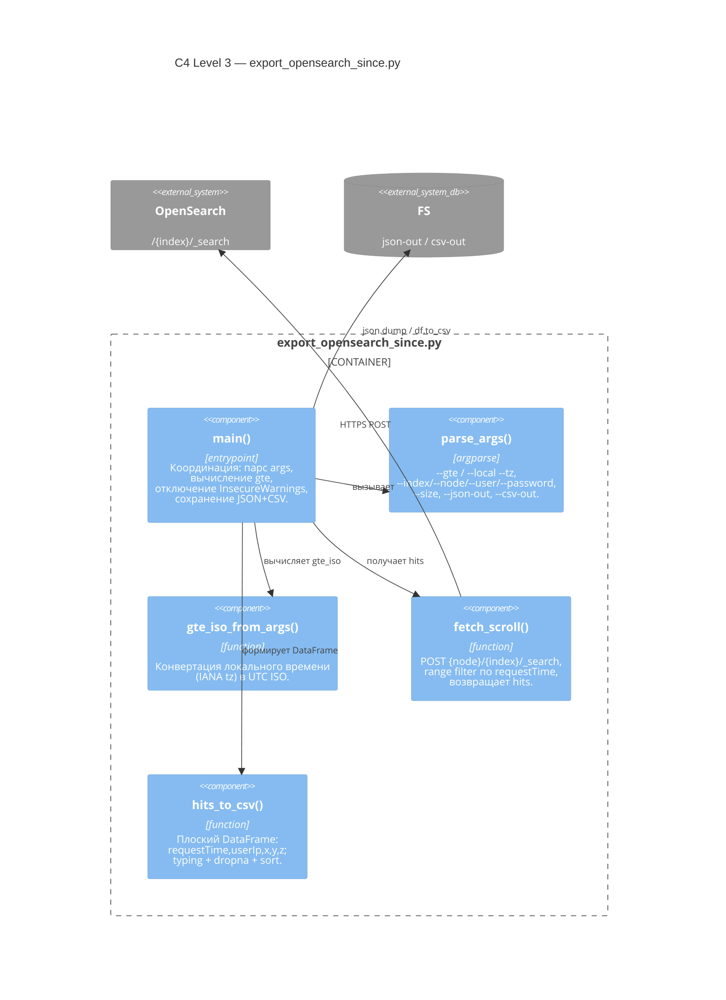

# C4 Level 3 — Component: `scripts/data/export_opensearch_since.py`

```mermaid
C4Component
    title C4 Level 3 — export_opensearch_since.py
    System_Ext(os_, "OpenSearch", "/{index}/_search")
    SystemDb_Ext(fs, "FS", "json-out / csv-out")

    Container_Boundary(c, "export_opensearch_since.py") {
        Component(main, "main()", "entrypoint", "Координация: парс args,<br/>вычисление gte,<br/>отключение InsecureWarnings,<br/>сохранение JSON+CSV.")
        Component(args, "parse_args()", "argparse", "--gte / --local --tz,<br/>--index/--node/--user/--password,<br/>--size, --json-out, --csv-out.")
        Component(gte, "gte_iso_from_args()", "function", "Конвертация локального времени<br/>(IANA tz) в UTC ISO.")
        Component(fetch, "fetch_scroll()", "function", "POST {node}/{index}/_search,<br/>range filter по requestTime,<br/>возвращает hits.")
        Component(tocsv, "hits_to_csv()", "function", "Плоский DataFrame:<br/>requestTime,userIp,x,y,z;<br/>typing + dropna + sort.")
    }

    Rel(main, args, "вызывает")
    Rel(main, gte, "вычисляет gte_iso")
    Rel(main, fetch, "получает hits")
    Rel(fetch, os_, "HTTPS POST")
    Rel(main, tocsv, "формирует DataFrame")
    Rel(main, fs, "json.dump / df.to_csv")
```
