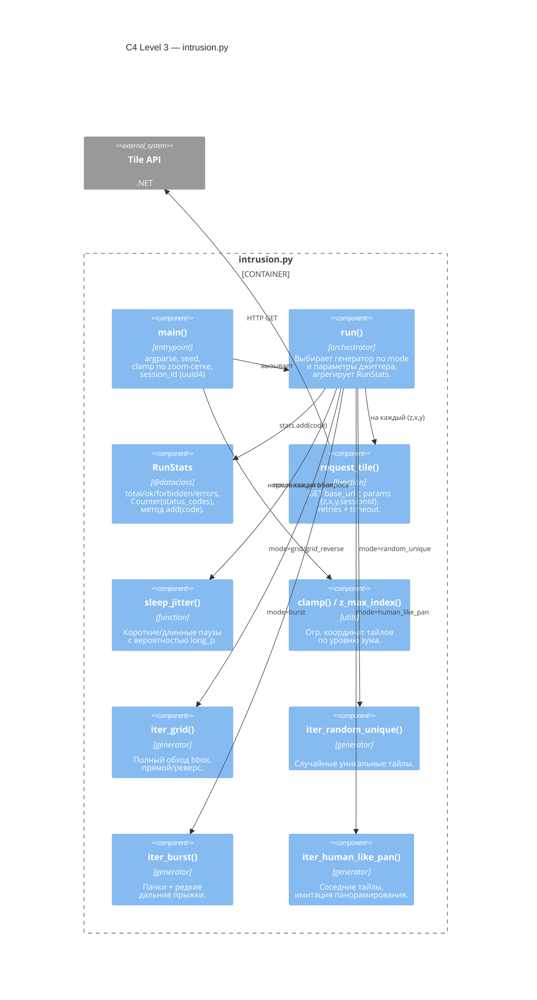

# C4 Level 3 — Component: `scripts/traffic/intrusion.py`

```mermaid
C4Component
    title C4 Level 3 — intrusion.py
    System_Ext(tileApi, "Tile API", ".NET")

    Container_Boundary(c, "intrusion.py") {
        Component(main, "main()", "entrypoint", "argparse, seed,<br/>clamp по zoom-сетке,<br/>session_id (uuid4)")
        Component(run, "run()", "orchestrator", "Выбирает генератор по mode<br/>и параметры джиттера,<br/>агрегирует RunStats.")

        Component(stats, "RunStats", "@dataclass", "total/ok/forbidden/errors,<br/>Counter(status_codes),<br/>метод add(code).")

        Component(req, "request_tile()", "function", "GET base_url с params<br/>{z,x,y,sessionId},<br/>retries + timeout.")
        Component(jitter, "sleep_jitter()", "function", "Короткие/длинные паузы<br/>с вероятностью long_p.")
        Component(clamp, "clamp() / z_max_index()", "utils", "Огр. координат тайлов<br/>по уровню зума.")

        Component(g_grid, "iter_grid()", "generator", "Полный обход bbox,<br/>прямой/реверс.")
        Component(g_rand, "iter_random_unique()", "generator", "Случайные уникальные тайлы.")
        Component(g_burst, "iter_burst()", "generator", "Пачки + редкие<br/>дальние прыжки.")
        Component(g_human, "iter_human_like_pan()", "generator", "Соседние тайлы,<br/>имитация панорамирования.")
    }

    Rel(main, run, "вызывает")
    Rel(run, g_grid, "mode=grid/grid_reverse")
    Rel(run, g_rand, "mode=random_unique")
    Rel(run, g_burst, "mode=burst")
    Rel(run, g_human, "mode=human_like_pan")
    Rel(run, req, "на каждый (z,x,y)")
    Rel(run, jitter, "после каждого запроса")
    Rel(run, stats, "stats.add(code)")
    Rel(req, tileApi, "HTTP GET")
    Rel(main, clamp, "нормализация bbox")
```
