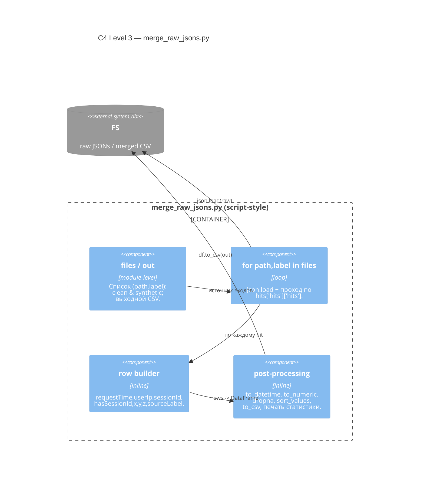

# C4 Level 3 — Component: `scripts/data/merge_raw_jsons.py`

```mermaid
C4Component
    title C4 Level 3 — merge_raw_jsons.py
    SystemDb_Ext(fs, "FS", "raw JSONs / merged CSV")

    Container_Boundary(c, "merge_raw_jsons.py (script-style)") {
        Component(cfg, "files / out", "module-level", "Список (path,label):<br/>clean & synthetic;<br/>выходной CSV.")
        Component(loop, "for path,label in files", "loop", "json.load + проход по<br/>hits['hits']['hits'].")
        Component(row, "row builder", "inline", "requestTime,userIp,sessionId,<br/>hasSessionId,x,y,z,sourceLabel.")
        Component(post, "post-processing", "inline", "to_datetime, to_numeric,<br/>dropna, sort_values,<br/>to_csv, печать статистики.")
    }

    Rel(cfg, loop, "источник входов")
    Rel(loop, row, "по каждому hit")
    Rel(row, post, "rows -> DataFrame")
    Rel(loop, fs, "json.load(raw)")
    Rel(post, fs, "df.to_csv(out)")
```
