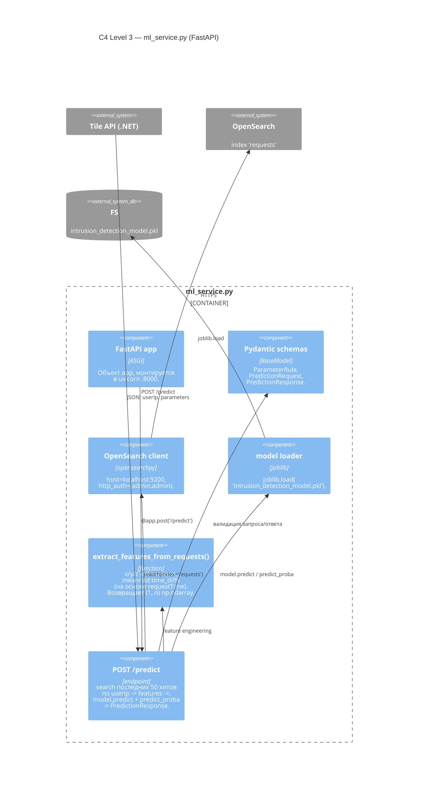

# C4 Level 3 — Component: `scripts/ml/ml_service.py`

```mermaid
C4Component
    title C4 Level 3 — ml_service.py (FastAPI)
    System_Ext(tileApi, "Tile API (.NET)")
    System_Ext(os_, "OpenSearch", "index 'requests'")
    SystemDb_Ext(fs, "FS", "intrusion_detection_model.pkl")

    Container_Boundary(c, "ml_service.py") {
        Component(app, "FastAPI app", "ASGI", "Объект app, монтируется<br/>в uvicorn :8000.")
        Component(models_, "Pydantic schemas", "BaseModel", "ParameterRule,<br/>PredictionRequest,<br/>PredictionResponse.")
        Component(client, "OpenSearch client", "opensearchpy", "host=localhost:9200,<br/>http_auth=(admin,admin).")
        Component(loader, "model loader", "joblib", "joblib.load(<br/>'intrusion_detection_model.pkl').")
        Component(extract, "extract_features_from_requests()", "function", "x/y/z std + unique,<br/>mean/std time_diffs<br/>(на основе requestTime).<br/>Возвращает (1, n) np.ndarray.")
        Component(predict, "POST /predict", "endpoint", "search последних 50 хитов<br/>по userIp -> features ->,<br/>model.predict + predict_proba<br/>-> PredictionResponse.")
    }

    Rel(tileApi, predict, "POST /predict<br/>JSON: userIp, parameters")
    Rel(predict, models_, "валидация запроса/ответа")
    Rel(predict, client, "search(index='requests')")
    Rel(client, os_, "HTTPS")
    Rel(predict, extract, "feature engineering")
    Rel(predict, loader, "model.predict / predict_proba")
    Rel(loader, fs, "joblib.load")
    Rel(app, predict, "@app.post('/predict')")
```
