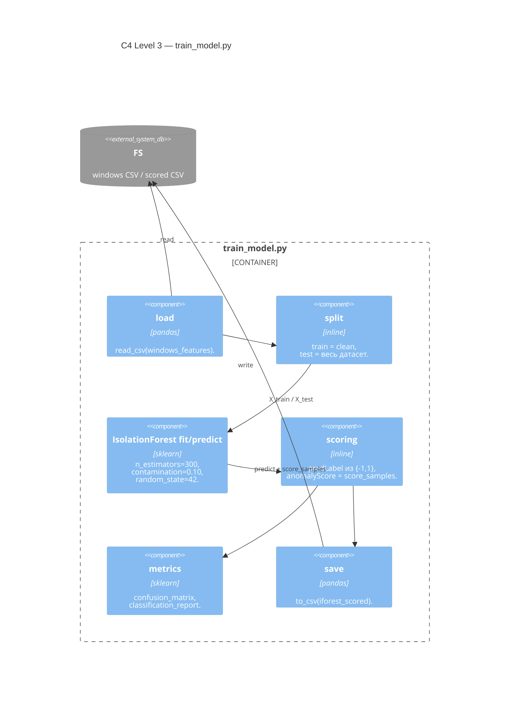

# C4 Level 3 — Component: `scripts/ml/train_model.py`

```mermaid
C4Component
    title C4 Level 3 — train_model.py
    SystemDb_Ext(fs, "FS", "windows CSV / scored CSV")

    Container_Boundary(c, "train_model.py") {
        Component(load, "load", "pandas", "read_csv(windows_features).")
        Component(split, "split", "inline", "train = clean,<br/>test = весь датасет.")
        Component(if_, "IsolationForest fit/predict", "sklearn", "n_estimators=300,<br/>contamination=0.10,<br/>random_state=42.")
        Component(score, "scoring", "inline", "predLabel из {-1,1},<br/>anomalyScore = score_samples.")
        Component(report, "metrics", "sklearn", "confusion_matrix,<br/>classification_report.")
        Component(save, "save", "pandas", "to_csv(iforest_scored).")
    }

    Rel(load, split, "")
    Rel(split, if_, "X_train / X_test")
    Rel(if_, score, "predict + score_samples")
    Rel(score, report, "")
    Rel(score, save, "")
    Rel(load, fs, "read")
    Rel(save, fs, "write")
```
