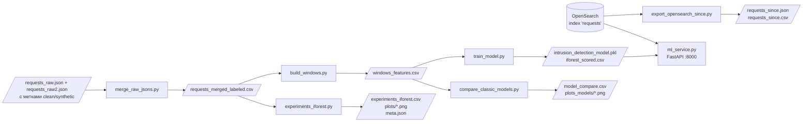
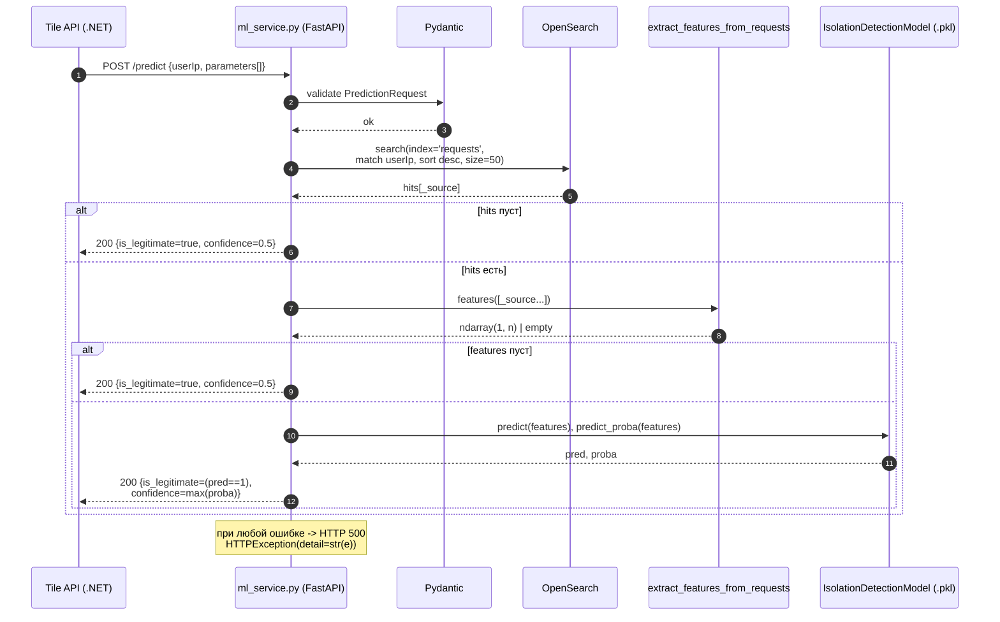

# C4 Level 4 — Code

C4 уровень 4 обычно изображают UML-диаграммой класса/последовательности.
Ниже — две диаграммы для двух самых нетривиальных мест системы:
поток данных пайплайна и онлайн-инференс `POST /predict`.

## 4.1 Поток данных пайплайна (offline)

## 4.2 Sequence — онлайн-инференс (`POST /predict`)

