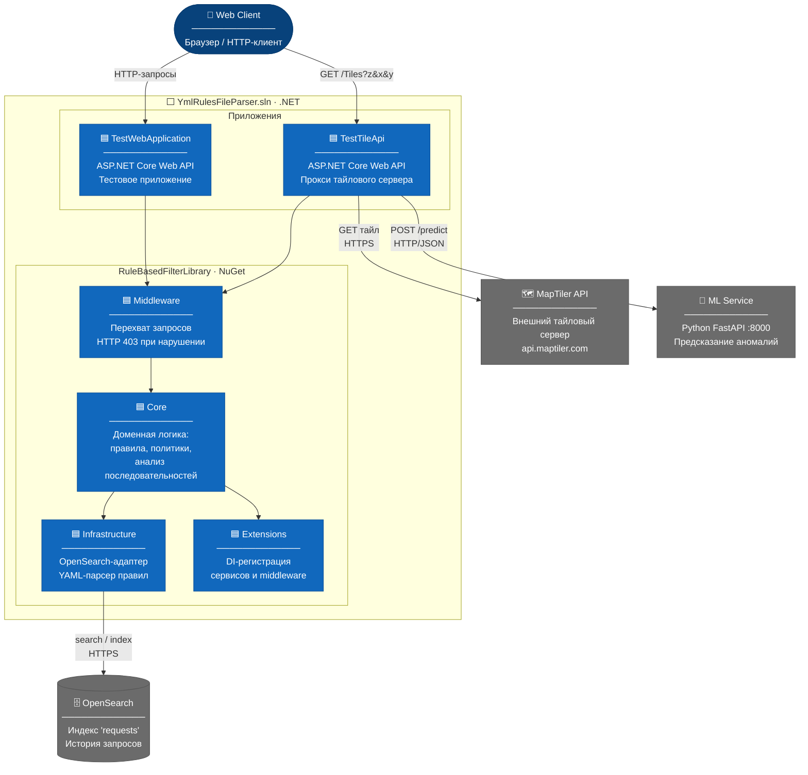

# C4 Level 2 — Container Diagram: C# Solution

Показывает контейнеры .NET-решения `YmlRulesFileParser.sln` и их взаимодействие
с внешними системами.

## Легенда контейнеров

| Контейнер | Тип | Назначение |
|---|---|---|
| **TestTileApi** | ASP.NET Core Web API | Прокси-сервер тайловых изображений с защитой от массового скачивания |
| **TestWebApplication** | ASP.NET Core Web API | Тестовое приложение для демонстрации базового фильтрования |
| **Middleware** | .NET-библиотека (in-process) | Перехватывает HTTP-запросы и применяет правила фильтрации |
| **Core** | .NET-библиотека (in-process) | Доменная логика: правила, политики, анализ последовательностей |
| **Infrastructure** | .NET-библиотека (in-process) | Адаптеры: хранение запросов в OpenSearch, загрузка правил из YAML |
| **Extensions** | .NET-библиотека (in-process) | Методы расширения для регистрации сервисов в DI-контейнере |
| **OpenSearch** | Внешняя БД | Хранит историю HTTP-запросов для анализа последовательностей |
| **MapTiler API** | Внешний сервис | Источник тайловых изображений карты |
| **ML Service** | Внешний сервис (Python) | FastAPI-сервис инференса модели IsolationForest для обнаружения аномалий |
