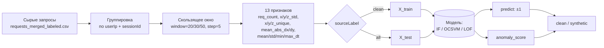

# Диаграммы ML-моделей

В репозитории используются **классические (не нейросетевые) модели обнаружения аномалий**
для детектирования синтетического / ботового трафика поверх агрегированных оконных признаков.
Поэтому под «слоями» здесь понимаются логические уровни pipeline-а
(подготовка данных → препроцессинг → ядро модели → решение), а под
«графом вычислений» — поток операций, через который проходит один входной образец `x`
для получения предсказания.

## Список моделей

| Модель | Где используется | Документ с диаграммами |
|---|---|---|
| Isolation Forest | `scripts/ml/train_model.py`, `scripts/ml/experiments_iforest.py` (основная модель) | [isolation-forest.md](./isolation-forest.md) |
| One-Class SVM (RBF) | `scripts/ml/compare_classic_models.py` | [one-class-svm.md](./one-class-svm.md) |
| Local Outlier Factor (novelty) | `scripts/ml/compare_classic_models.py` | [local-outlier-factor.md](./local-outlier-factor.md) |

Дополнительно описан общий pipeline признаков и онлайн-инференса:

- [feature-pipeline.md](./feature-pipeline.md) — извлечение признаков из «сырых» запросов
  и работа сервиса `scripts/ml/ml_service.py`.

## Общая схема обучения и применения

Все три модели работают по одной и той же схеме **one-class / novelty detection**:
обучение производится **только на классе `clean`**, предсказание — на всём множестве окон,
а метка `synthetic` присваивается тем точкам, которые модель считает аномалиями.



## Единый набор признаков

```mermaid
flowchart TB
    subgraph W[Окно из N запросов]
        x[(x[0..N-1])]
        y[(y[0..N-1])]
        z[(z[0..N-1])]
        t[(requestTime[0..N-1])]
    end
    x --> f1[x_std]
    x --> f2[x_unique]
    x --> f3[mean_abs_dx = mean&#124;diff x&#124;]
    y --> f4[y_std]
    y --> f5[y_unique]
    y --> f6[mean_abs_dy = mean&#124;diff y&#124;]
    z --> f7[z_std]
    z --> f8[z_unique]
    t --> f9[dt = diff t]
    f9 --> f10[mean_dt]
    f9 --> f11[std_dt]
    f9 --> f12[min_dt]
    f9 --> f13[max_dt]
    W --> f0[req_count = N]
    f0 & f1 & f2 & f3 & f4 & f5 & f6 & f7 & f8 & f10 & f11 & f12 & f13 --> V["x ∈ ℝ¹³"]
```

Этот вектор `x ∈ ℝ¹³` подаётся на вход каждой из трёх моделей, чьи внутренние
архитектуры и вычислительные графы описаны в отдельных файлах.
