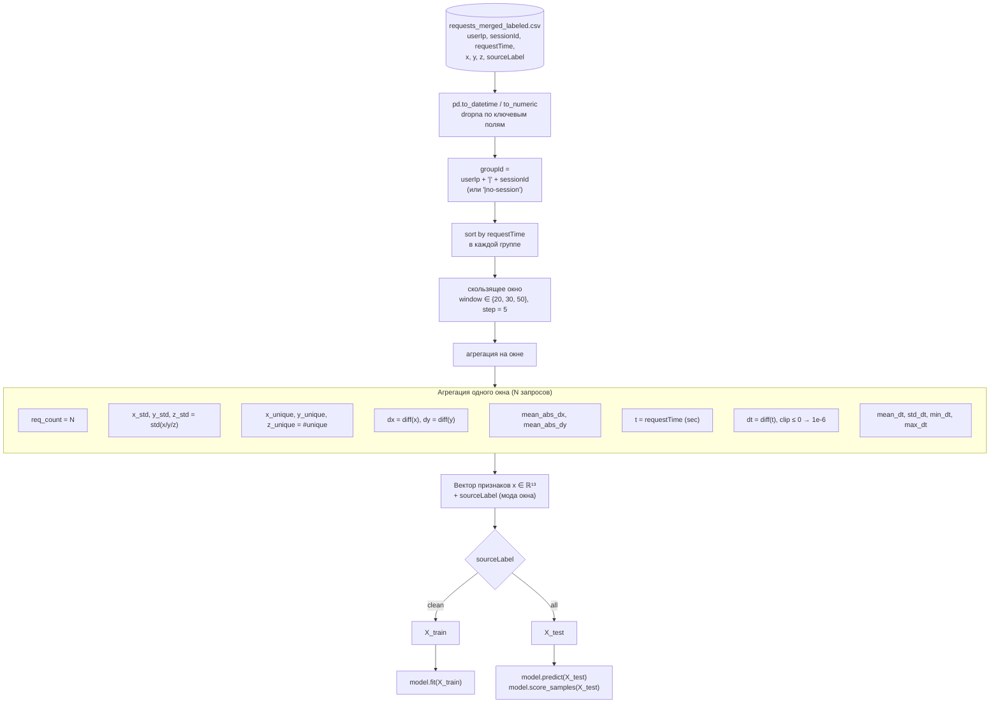
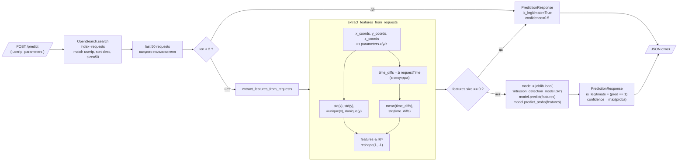
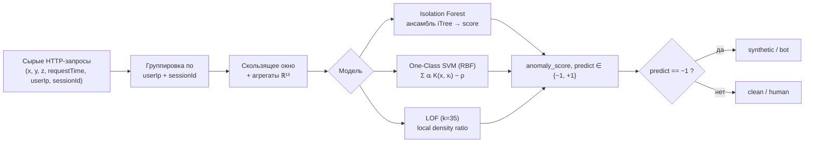

# Pipeline признаков и онлайн-инференс

В этом документе показан **полный путь** от сырого HTTP-запроса до ML-предсказания:
как формируются признаки в офлайн-обучении (`experiments_iforest.py`) и как они
строятся «на лету» в сервисе инференса `scripts/ml/ml_service.py`.

## Офлайн: построение оконных признаков

Источник: `scripts/ml/experiments_iforest.py`, функция `build_windows`.

## Онлайн-инференс: `ml_service.py`

FastAPI-сервис принимает `userIp` пользователя, достаёт его последние запросы
из OpenSearch и считает сокращённый набор признаков прямо в `extract_features_from_requests`.

> ⚠️ Признаки в `ml_service.py` (6 значений: `std(x)`, `std(y)`, `#unique(x)`,
> `#unique(y)`, `mean(dt)`, `std(dt)`) — это **подмножество** офлайн-набора из
> 13 признаков. Для совместимости с моделями из `experiments_iforest.py` /
> `compare_classic_models.py` потребовалось бы расширить онлайн-извлечение
> признаков до полного списка из [README.md](./README.md).

## Сводный граф «данные → модель → решение»

