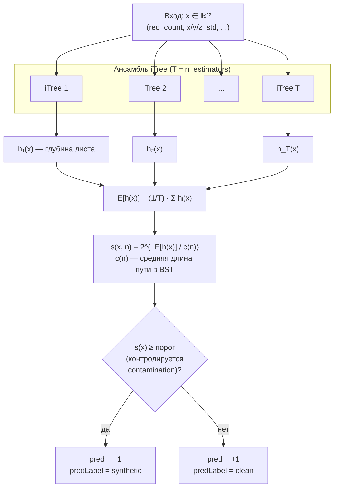
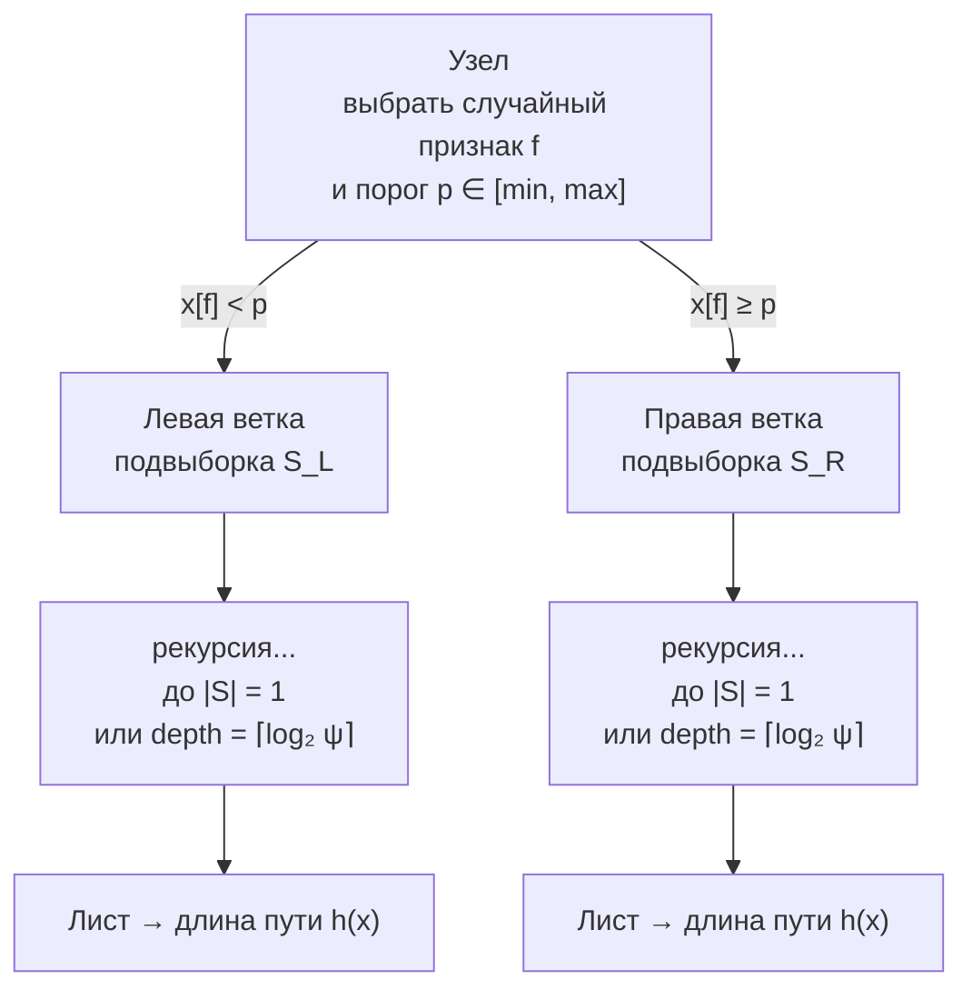
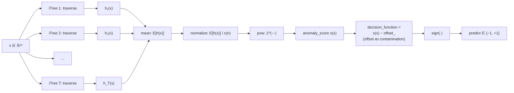

# Isolation Forest

**Файлы:** `scripts/ml/train_model.py`, `scripts/ml/experiments_iforest.py`,
сравнение в `scripts/ml/compare_classic_models.py`.

## Конфигурация

| Параметр | Значение |
|---|---|
| `n_estimators` | 300 (`train_model.py`) / 500 (эксперименты, `compare_classic_models.py`) |
| `contamination` | 0.10 / перебор {0.05, 0.08, 0.10, 0.15} / 0.05 |
| `random_state` | 42 |
| Обучающая выборка | только `sourceLabel == "clean"` |
| Размерность входа | 13 признаков (см. [README.md](./README.md)) |

## Диаграмма «слоёв» (логических блоков)

Isolation Forest — это **ансамбль рандомизированных деревьев** (`iTree`).
В роли «слоёв» выступают этапы pipeline-а: входные признаки → ансамбль из `T`
независимых iTree → агрегация глубин в anomaly score → решающий порог.

## Структура одного iTree

Каждое дерево строится рекурсивно на бутстрэп-подвыборке: на каждом узле
выбирается **случайный признак** `f` и **случайный порог** `p ∈ [min(f), max(f)]`,
точки делятся по условию `x[f] < p`. Деревья растут до изоляции точки или
до предельной глубины `ceil(log2(ψ))`, где `ψ` — размер подвыборки.

## Граф вычислений для одного образца

Поток операций для конкретного входа `x` при инференсе
(`model.predict(x)` / `model.score_samples(x)`):

Реализация в `experiments_iforest.py` использует `-model.score_samples(X)`
как непрерывный «anomaly score» для построения ROC/PR-кривых, а
`model.predict(X) == -1` интерпретируется как метка `synthetic`.
