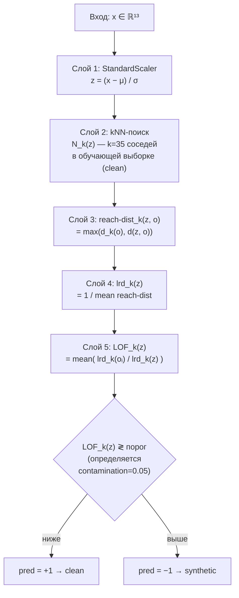
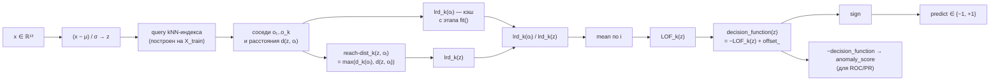

# Local Outlier Factor (novelty mode)

**Файл:** `scripts/ml/compare_classic_models.py`

```python
Pipeline([
    ("scaler", StandardScaler()),
    ("lof", LocalOutlierFactor(n_neighbors=35, contamination=0.05, novelty=True)),
])
```

| Параметр | Значение |
|---|---|
| Препроцессинг | `StandardScaler` |
| `n_neighbors` (k) | 35 |
| `contamination` | 0.05 |
| `novelty` | `True` (используется `predict` для новых точек) |
| Обучающая выборка | только `sourceLabel == "clean"` |

## Идея модели

LOF сравнивает **локальную плотность** точки с локальной плотностью её соседей.
Если у `x` плотность заметно ниже, чем у его `k` ближайших соседей в обучающей
выборке, то LOF(x) > 1 — точка считается аномальной.

Ключевые величины:

- `N_k(x)` — множество k ближайших соседей точки `x`;
- `reach-dist_k(x, o) = max(d_k(o), d(x, o))` — reachability distance;
- `lrd_k(x) = 1 / mean_{o ∈ N_k(x)} reach-dist_k(x, o)` — локальная плотность;
- `LOF_k(x) = mean_{o ∈ N_k(x)} (lrd_k(o) / lrd_k(x))`.

## Диаграмма «слоёв» pipeline-а



## Граф вычислений для одного образца (novelty inference)



В режиме `novelty=True` индекс `kNN` и значения `lrd_k(oᵢ)` обучающих точек
фиксируются на этапе `fit(X_train)`, а для нового `x` пересчитывается только
`lrd_k(x)` и итоговый `LOF_k(x)`. В `compare_classic_models.py` бинарная метка
`synthetic` получается из `predict == -1`, а непрерывный score — из
`-decision_function(x)`.
