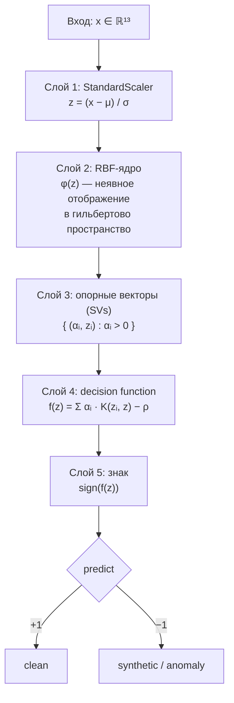
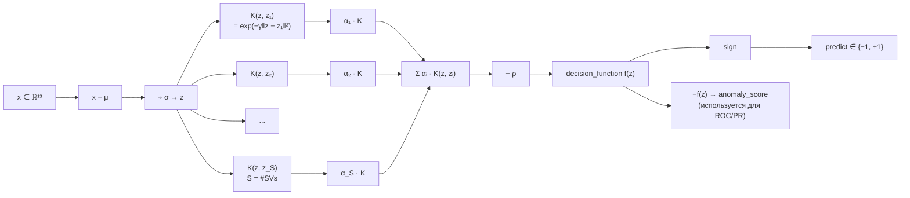

# One-Class SVM (RBF)

**Файл:** `scripts/ml/compare_classic_models.py`

В коде модель обёрнута в `sklearn.pipeline.Pipeline`:

```python
Pipeline([
    ("scaler", StandardScaler()),
    ("ocsvm", OneClassSVM(kernel="rbf", nu=0.05, gamma="scale")),
])
```

| Параметр | Значение |
|---|---|
| Препроцессинг | `StandardScaler` (центрирование + масштабирование) |
| Ядро | RBF: `K(x, xᵢ) = exp(−γ · ‖x − xᵢ‖²)` |
| `nu` | 0.05 (верхняя граница доли «выбросов» в обучении) |
| `gamma` | `"scale"` → `1 / (n_features · Var(X))` |
| Обучающая выборка | только `sourceLabel == "clean"` |

## Диаграмма «слоёв» pipeline-а



«Опорные векторы» формируются на этапе обучения как решение задачи
квадратичного программирования с ограничением `nu`: модель ищет гиперплоскость
в RBF-пространстве, отделяющую начало координат от данных с максимальным
зазором, и сохраняет ненулевые `αᵢ` вместе с соответствующими `zᵢ`.

## Граф вычислений для одного образца



В `compare_classic_models.py` функция `get_anomaly_score` берёт именно
`-decision_function(x)` как непрерывный показатель аномальности; `predict == -1`
переводится в бинарную метку `synthetic = 1`.
